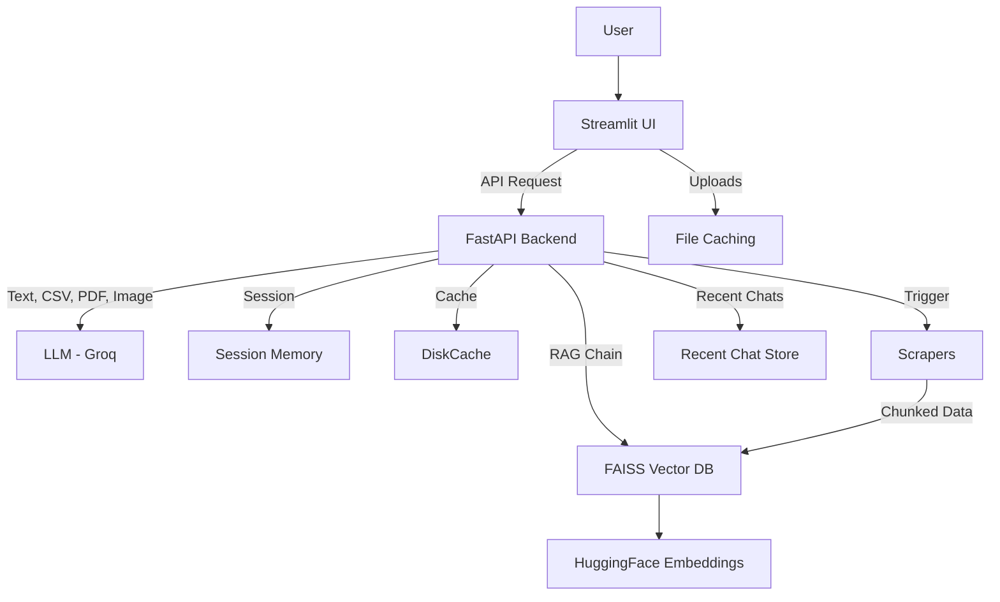
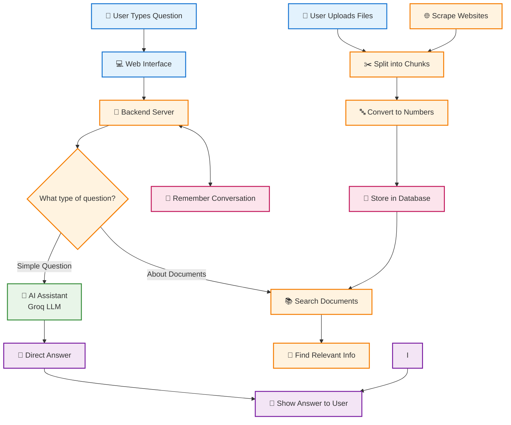

# DataAnalystBot 🤖

**DataAnalystBot** is an interactive, AI-powered assistant designed to help users with all things data analysis. It leverages advanced retrieval-augmented generation (RAG) techniques, a custom vector database, and a conversational interface to provide expert guidance on data cleaning, visualization, statistics, machine learning, and popular tools like Python, SQL, Excel, and more.

---

## 🚀 Features

- **Conversational AI**: Chat with an LLM (Llama 3/4 via Groq) about any data analysis topic.
- **Image Understanding**: Upload images (e.g., charts, screenshots, or photos) and ask questions about them. The bot uses a multimodal LLM to analyze and respond, then grounds the answer using your chat history and knowledge base.
- **CSV Data Analysis**: Upload a CSV file and ask questions about its content. The bot uses the CSV content as context for the LLM, providing data-aware answers.
- **PDF Data Analysis**: Upload a PDF file and ask questions about its content. The bot extracts text from the PDF and uses it as context for the LLM, enabling document-aware responses.
- **File Caching**: Uploaded CSV, image, and PDF data are cached for each session, enabling fast, context-aware follow-up questions without re-uploading or re-processing files.
- **Image Upload Rate Limiting**: Each user can upload up to 3 images every 6 hours. If the limit is reached, only text, CSV, or PDF questions are allowed until the window resets.
- **Image Display in Chat**: Uploaded images are shown inline with your messages for easy reference.
- **Retrieval-Augmented Generation (RAG)**: Answers are grounded in a curated, chunked knowledge base from top data science sources.
- **Session Memory**: Each user session maintains its own chat history for context-aware conversations.
- **Recent Chats**: All conversations are saved and can be resumed from the sidebar.
- **Custom Vector Database**: Fast, semantic search over chunked documents using FAISS and HuggingFace embeddings.
- **Modern UI**: Built with Streamlit for a clean, interactive chat experience.
- **Extensible Scrapers**: Easily add new data sources with modular web scrapers.

---

## 📸 Screenshots


*Chat with DataAnalystBot about Power BI for data analysis!*

---

## 🏗️ Architecture Overview


## 🤖 Output Generation



---

## 📚 Data Sources

- [GeeksforGeeks](https://geeksforgeeks.org)
- [TPointTech](https://tpointtech.com)
- [Towards Data Science](https://towardsdatascience.com)

All articles are scraped, chunked (500 chars), and stored in `data/data.jsonl` for efficient retrieval.

---

## 🛠️ Tech Stack

- **Frontend**: [Streamlit](https://streamlit.io/)
- **Backend**: [FastAPI](https://fastapi.tiangolo.com/)
- **LLM**: [Groq Llama 3 & Multimodal Llama 4](https://groq.com/)
- **Vector DB**: [FAISS](https://github.com/facebookresearch/faiss)
- **Embeddings**: [HuggingFace Transformers](https://huggingface.co/)
- **Web Scraping**: [Selenium](https://selenium.dev/)
- **Session Memory**: In-memory per-session chat history
- **Caching**: DiskCache and Streamlit cache for fast file and context retrieval

---

## ⚡ Quickstart

### 1. Clone the Repository

```bash
git clone https://github.com/Lokesh-DataScience/Data-Analyst-Expert-Bot.git
cd DataAnalystBot
```

### 2. Install Dependencies

```bash
python -m venv .venv
.venv\Scripts\activate  # On Windows
pip install -r requirements.txt
```

### 3. Set Up Environment Variables

Create a `.env` file in the root directory:

```env
GROQ_API_KEY=your_groq_api_key
LANGSMITH_API_KEY=your_langsmith_api_key
```

### 4. Scrape and Prepare Data

Run the scrapers in the `scrapers/` folder to populate `data/data.jsonl` with chunked content:

```bash
python scrapers/gfg_scraper.py
python scrapers/pointtech_scraper.py
python scrapers/towardsdatascience_scrapper.py
```

### 5. Build the Vector Database

```bash
python vector_db/faiss_db.py
```

### 6. Start the Backend API

```bash
uvicorn api.main:app --reload
```

### 7. Launch the Streamlit Frontend

```bash
streamlit run streamlit_app/app.py
```

---

## 💬 Usage

- Open [http://localhost:8501](http://localhost:8501) in your browser.
- Ask questions about data analysis, tools, or techniques.
- **To analyze an image:** Upload a jpg, jpeg, or png file and enter your question. The bot will analyze the image and respond.
- **To analyze a CSV:** Upload a CSV file and ask a question about its content. The bot will use the CSV data as context for its answer.
- **To analyze a PDF:** Upload a PDF file and ask a question about its content. The bot will use the PDF text as context for its answer.
- **Note:** You can upload up to 3 images every 6 hours. If you reach the limit, you can still ask text questions.
- **Resume conversations:** Select any recent chat from the sidebar to continue where you left off.

---

## 🧩 Project Structure

```
DataAnalystBot/
│
├── api/                  # FastAPI backend
│   └── main.py
├── chains/               # RAG chain construction
│   └── rag_chain.py
├── data/                 # Chunked knowledge base (JSONL)
│   └── data.jsonl
├── loaders/              # Data loading utilities
│   ├── load_data.py
|   ├── load_csv.py
|   └── load_pdf.py
├── memory/               # Session memory management
│   └── session_memory.py
├── scrapers/             # Web scrapers for sources
│   ├── gfg_scraper.py
│   ├── pointtech_scraper.py
│   └── towardsdatascience_scrapper.py
├── streamlit_app/        # Streamlit UI
│   └── app.py
├── vector_db/            # Vector DB creation/loading
│   └── faiss_db.py
├── requirements.txt
└── README.md
```

---

## 📝 Customization

- **Add new sources**: Write a new scraper in `scrapers/`, chunk the content, and append to `data/data.jsonl`.
- **Change chunk size**: Adjust the `textwrap.wrap(..., width=500)` in scrapers.
- **Swap LLM or embeddings**: Update model names in `chains/rag_chain.py` or `vector_db/faiss_db.py`.

---

## 🛡️ Security & Privacy

- All chat history is stored in memory per session and is not persisted.
- API keys are loaded from `.env` and never exposed to the frontend.

---

## 🤝 Contributing

Pull requests, issues, and feature suggestions are welcome!  
Please open an issue or submit a PR.

---

## 📄 License

MIT License. See [LICENSE](LICENSE) for details.

---

## 🙏 Acknowledgements

- [LangChain](https://github.com/langchain-ai/langchain)
- [Groq](https://groq.com/)
- [HuggingFace](https://huggingface.co/)
- [FAISS](https://github.com/facebookresearch/faiss)
- [Streamlit](https://streamlit.io/)
- [Selenium](https://selenium.dev/)

---

**Happy Analyzing!** 🚀