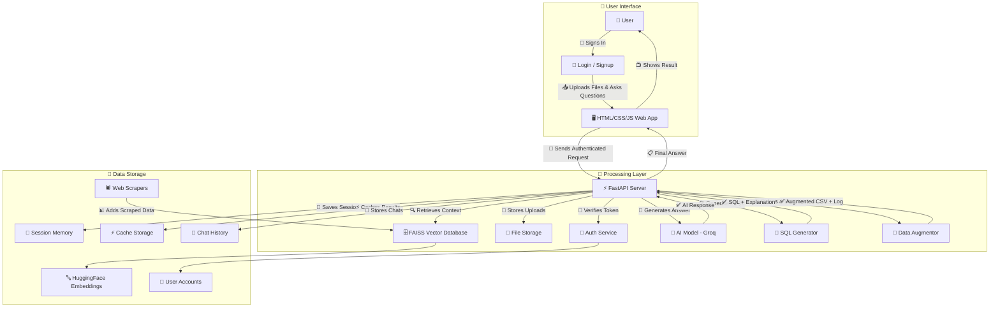

# DataAnalystBot 🤖

**DataAnalystBot** is an interactive, AI-powered assistant designed to help users with all things data analysis. It leverages advanced retrieval-augmented generation (RAG) techniques, a custom vector database, and a conversational interface to provide expert guidance on data cleaning, visualization, statistics, machine learning, and popular tools like Python, SQL, Excel, and more.

---

## 🚀 Features

- **Conversational AI**: Chat with an LLM (Llama 3/4 via Groq) about any data analysis topic.
- **User Authentication**: Sign up and sign in with email/password to access your personal workspace. Sessions are token-based (`Authorization: Bearer <token>`), with a "remember me" option and a demo login mode for quick exploration.
- **Multi-File Upload & Analysis**: Upload and analyze images (charts, screenshots), CSV/Excel files, and PDFs **simultaneously**. The bot uses all provided files as context for your question via the `/multi-upload` endpoint.
- **Data Cleaning & Analysis Endpoints**: Use `/analyze-data` for full AI-powered analysis (cleaning, stats, insights, visualizations) and `/clean-data` for fast, quota-free cleaning and summary.
- **SQL Query Generator**: Describe what you want in plain English, provide an optional schema or upload a CSV to auto-detect columns, and get a ready-to-run SQL query with a full explanation and optimization suggestions. Supports PostgreSQL, MySQL, SQLite, SQL Server, Oracle, BigQuery, and Snowflake.
- **Auto Data Augmentation**: Upload a CSV and let the bot automatically diagnose data quality issues — missing values, outliers, duplicates, skewed distributions, and class imbalance — then apply fixes in one click. Download the cleaned dataset or feed it directly into analysis.
- **Modern HTML/CSS/JS GUI**: A standalone, dependency-free frontend with a login/signup flow and a dashboard featuring tabs for chat, data upload, SQL generation, and data augmentation, plus a sidebar with session history, API status indicator, and user account controls.
- **Image Understanding**: Upload images and ask questions about them. The bot uses a multimodal LLM to analyze and respond, then grounds the answer using your chat history and knowledge base.
- **CSV Data Analysis**: Upload a CSV file and ask questions about its content. The bot uses the CSV content as context for the LLM, providing data-aware answers.
- **PDF Data Analysis**: Upload a PDF file and ask questions about its content. The bot extracts text from the PDF and uses it as context for the LLM, enabling document-aware responses.
- **File Caching**: Uploaded CSV, image, and PDF data are cached for each session, enabling fast, context-aware follow-up questions without re-uploading or re-processing files.
- **Image Upload Rate Limiting**: Each user can upload up to 3 images every 6 hours. If the limit is reached, only text, CSV, or PDF questions are allowed until the window resets.
- **Image Display in Chat**: Uploaded images are shown inline with your messages for easy reference.
- **Retrieval-Augmented Generation (RAG)**: Answers are grounded in a curated, chunked knowledge base from top data science sources.
- **Session Memory**: Each user session maintains its own chat history for context-aware conversations.
- **Recent Chats**: All conversations are saved and can be resumed from the sidebar.
- **Custom Vector Database**: Fast, semantic search over chunked documents using FAISS and HuggingFace embeddings.
- **Extensible Scrapers**: Easily add new data sources with modular web scrapers.

---

## 📸 Screenshots


*Chat with DataAnalystBot about Power BI for data analysis!*

---

## 🏗️ Architecture Overview

```mermaid
flowchart TD
    subgraph "👤 User Interface"
        A[👤 User] -->|🔐 Signs In| AUTH[🔑 Login / Signup]
        AUTH -->|📤 Uploads Files & Asks Questions| B[🖥️ HTML/CSS/JS Web App]
    end

    subgraph "🔄 Processing Layer"
        B -->|📡 Sends Authenticated Request| C[⚡ FastAPI Server]
        C -->|🔑 Verifies Token| AUTHSVC[🔐 Auth Service]
        C -->|💾 Stores Uploads| J[📁 File Storage]
        C -->|🔍 Retrieves Context| E[🗄️ Vector Database]
        C -->|🧠 Generates Answer| D[🤖 AI Model - Groq]
        C -->|🛠️ Generates SQL| L[📝 SQL Generator]
        C -->|🔧 Cleans & Enriches| M[🧬 Data Augmentor]
    end

    subgraph "💾 Data Storage"
        E[🗄️ FAISS Vector Database]
        F[🔤 HuggingFace Embeddings]
        G[💭 Session Memory]
        I[⚡ Cache Storage]
        K[💬 Chat History]
        H[🕷️ Web Scrapers]
        U[👥 User Accounts]
    end

    %% Data Flow
    E --> F
    H -->|📊 Adds Scraped Data| E
    AUTHSVC --> U
    C -->|💾 Saves Session| G
    C -->|⚡ Caches Results| I
    C -->|💬 Stores Chats| K
    L -->|✅ SQL + Explanation| C
    M -->|✅ Augmented CSV + Log| C

    %% Response Flow
    D -->|✅ AI Response| C
    C -->|📋 Final Answer| B
    B -->|📺 Shows Result| A

    class A,B,AUTH userStyle
    class C,D,J,L,M,AUTHSVC processStyle
    class E,F,G,H,I,K,U storageStyle
```

---

## 🔐 Authentication

The frontend includes a login and signup screen, separate from the main dashboard.

- **Sign up**: Create an account with a name, email, and password.
- **Sign in**: Authenticate with email and password, with an optional "remember me" to persist your session across browser restarts.
- **Demo login**: Skip account creation and explore the dashboard with a temporary demo session.
- **Session token**: On successful login/signup, the backend returns a token that the frontend stores and sends as `Authorization: Bearer <token>` on every API request.
- **Sign out**: Clears the stored session and returns to the login screen.

> **Backend note:** The frontend expects `POST /auth/login` and `POST /auth/signup` endpoints returning `{ "token": "...", "user": { "name": "...", "email": "..." } }`. If these endpoints are not yet implemented (HTTP 404) or the API is unreachable, the frontend automatically falls back to a local demo session so the UI remains fully usable during development.

---

## 🔧 Auto Data Augmentation

The augmentation pipeline runs in three stages — nothing is applied silently without the user reviewing and approving the plan first.

**Stage 1 — Diagnose**  
Scans the uploaded CSV and reports all detected issues with severity ratings:

| Issue | Detection Method |
|---|---|
| Missing values | Per-column null count + percentage |
| Duplicate rows | Exact row matching |
| Outliers | IQR (1.5× fence) per numeric column |
| Skewed distributions | Skewness > 1.0 on numeric columns with all-positive values |
| Class imbalance | Majority/minority ratio > 3:1 on categorical columns |
| Low row count | Dataset smaller than 100 rows |

**Stage 2 — Augment (user-controlled)**  
Each fix can be toggled on or off before applying:

| Option | Technique |
|---|---|
| Impute Missing Values | KNN imputation (≤10 numeric cols) or median; mode or "Unknown" for categorical |
| Treat Outliers | Winsorization — caps values at 1st/99th percentile |
| Remove Duplicates | Exact deduplication with reset index |
| Fix Skewed Distributions | log1p transform on skewed numeric columns |
| Generate Synthetic Rows | Gaussian noise (numeric) + frequency sampling (categorical) targeting 2× row count |

**Stage 3 — Review & Export**  
After augmentation the user sees before/after row counts, a full change log, a side-by-side data preview, a **Download Augmented CSV** button, and a one-click **Run Analysis on Augmented Data** option that feeds directly into the existing `/analyze-data` pipeline.

---

## 🛠️ Natural Language to SQL Query Generator

The SQL Query Generator lets you describe what you want in plain English and instantly receive a production-ready SQL query — no SQL expertise required.

**How it works in three steps:**

**Step 1 — Describe your query**  
Type a plain English description of what data you want. For example:
> *"Show me the top 10 customers by total revenue from completed orders in the last 90 days, only include customers with at least 2 orders."*

**Step 2 — Provide context (optional but recommended)**  
Paste your table schema as DDL, or upload a CSV file to let the bot auto-detect column names and data types. Also select your database dialect and the type of query you need.

**Step 3 — Get your query**  
The bot returns three things:
- ✅ A ready-to-run SQL query formatted for your chosen database
- 📖 A plain English explanation of what the query does and why
- 💡 Optimization suggestions such as index recommendations or alternative approaches

You can download the result as a `.sql` file directly from the interface.

---

**Supported databases:**

| Database | Dialect Support |
|---|---|
| PostgreSQL | ✅ Full |
| MySQL | ✅ Full |
| SQLite | ✅ Full |
| Microsoft SQL Server | ✅ Full |
| Oracle | ✅ Full |
| Google BigQuery | ✅ Full |
| Snowflake | ✅ Full |

---

**Supported query types:**

- SELECT / Fetch Data
- INSERT / Add Data
- UPDATE / Modify Data
- DELETE / Remove Data
- JOIN / Combine Tables
- Aggregation / GROUP BY
- Subquery / CTE
- Other / Custom

---

**Example input → output:**

**Input description:**
```Find all customers who placed more than 3 orders in the last 30 days,
sorted by total spend descending.```

Generated query:
```sql
SELECT
    c.id,
    c.name,
    c.country,
    COUNT(o.id)   AS order_count,
    SUM(o.total)  AS total_spent
FROM customers c
JOIN orders o
    ON o.customer_id = c.id
WHERE
    o.status      = 'completed'
    AND o.created_at >= NOW() - INTERVAL '30 days'
GROUP BY
    c.id, c.name, c.country
HAVING
    COUNT(o.id) > 3
ORDER BY
    total_spent DESC;
```

> **Note:** Generated queries are never executed server-side. The bot returns query text only — your database stays safe.

---
## 📚 Data Sources

- [GeeksforGeeks](https://geeksforgeeks.org)
- [TPointTech](https://tpointtech.com)
- [Towards Data Science](https://towardsdatascience.com)

All articles are scraped, chunked (500 chars), and stored in `data/data.jsonl` for efficient retrieval.

---

## 🛠️ Tech Stack

- **Frontend**: Standalone HTML, CSS, and JavaScript (no build step or framework required) with login/signup authentication screens
- **Backend**: [FastAPI](https://fastapi.tiangolo.com/)
- **LLM**: [Groq Llama 3 & Multimodal Llama 4](https://groq.com/)
- **Vector DB**: [FAISS](https://github.com/facebookresearch/faiss)
- **Embeddings**: [HuggingFace Transformers](https://huggingface.co/)
- **Web Scraping**: [Selenium](https://selenium.dev/)
- **Data Augmentation**: [scikit-learn](https://scikit-learn.org/) + [SciPy](https://scipy.org/)
- **Session Memory**: In-memory per-session chat history
- **Caching**: DiskCache for fast file and context retrieval

---

## ⚡ Quickstart

### 1. Clone the Repository
```bash
git clone https://github.com/Lokesh-DataScience/Data-Analyst-Expert-Bot.git
cd DataAnalystBot
```

### 2. Install Dependencies
```bash
python -m venv .venv
.venv\Scripts\activate  # On Windows
pip install -r requirements.txt
```

### 3. Set Up Environment Variables

Create a `.env` file in the root directory:
```env
GROQ_API_KEY=your_groq_api_key
LANGSMITH_API_KEY=your_langsmith_api_key
```

### 4. Scrape and Prepare Data

Run the scrapers in the `scrapers/` folder to populate `data/data.jsonl` with chunked content:
```bash
python scrapers/gfg_scraper.py
python scrapers/pointtech_scraper.py
python scrapers/towardsdatascience_scrapper.py
```

### 5. Build the Vector Database
```bash
python vector_db/faiss_db.py
```

### 6. Start the Backend API
```bash
uvicorn api.main:app --reload
```

### 7. Launch the Frontend

The frontend is a static HTML/CSS/JS app — no build tools required. Open `frontend/index.html` directly in your browser, or serve it locally:
```bash
cd frontend
python -m http.server 5500
```
Then open [http://localhost:5500](http://localhost:5500).

On first load you'll see the **sign in / sign up** screen. Use **Continue with demo account** to explore the dashboard without creating an account, or sign up to create a persistent session. Make sure the API base URL in the sidebar points to your running FastAPI server (default `http://localhost:8000`).

---

## 💬 Usage

- Open the frontend in your browser and sign in (or use the demo login).
- Ask questions about data analysis, tools, or techniques.
- **To analyze an image:** Upload a jpg, jpeg, or png file and enter your question. The bot will analyze the image and respond.
- **To analyze a CSV:** Upload a CSV file and ask a question about its content. The bot will use the CSV data as context for its answer.
- **To analyze a PDF:** Upload a PDF file and ask a question about its content. The bot will use the PDF text as context for its answer.
- **To generate a SQL query:** Go to the **SQL Generator** tab. Paste your schema (or upload a CSV to auto-detect columns), select your database type and query type, describe what you want in plain English, and click **Generate SQL query**. The bot returns a ready-to-run query, a plain English explanation, and optimization suggestions you can download as a `.sql` file.
- **To augment a dataset:** Go to the **Data Augmentation** tab. Upload a CSV, click **Diagnose data** to see a full issues report and recommended fixes, toggle which steps to apply, then click **Apply augmentation**. Review the change log and before/after preview, download the cleaned CSV, or click **Run analysis on augmented data** to analyze it immediately.
- **Note:** You can upload up to 3 images every 6 hours. If you reach the limit, you can still ask text questions.
- **Resume conversations:** Select any recent chat from the sidebar to continue where you left off.
- **Sign out:** Use the sign-out icon next to your account name in the sidebar.

---

## 🧩 Project Structure

```
DataAnalystBot/
│
├── api/                  # FastAPI backend
│   └── main.py
├── chains/               # RAG chain construction
│   └── rag_chain.py
├── data/                 # Chunked knowledge base (JSONL)
│   └── data.jsonl
├── frontend/             # Standalone HTML/CSS/JS UI
│   ├── index.html
│   ├── css/
│   │   └── styles.css
│   └── js/
│       ├── auth.js
│       └── app.js
├── loaders/              # Data loading utilities
│   ├── load_data.py
│   ├── load_csv.py
│   └── load_pdf.py
├── memory/               # Session memory management
│   └── session_memory.py
├── scrapers/             # Web scrapers for sources
│   ├── gfg_scraper.py
│   ├── pointtech_scraper.py
│   └── towardsdatascience_scrapper.py
├── utils/                # Backend utilities
│   ├── data_analyzer.py
│   └── data_augmentor.py
├── vector_db/            # Vector DB creation/loading
│   └── faiss_db.py
├── requirements.txt
└── README.md
```

---

## 📝 Customization

- **Add new sources**: Write a new scraper in `scrapers/`, chunk the content, and append to `data/data.jsonl`.
- **Change chunk size**: Adjust the `textwrap.wrap(..., width=500)` in scrapers.
- **Swap LLM or embeddings**: Update model names in `chains/rag_chain.py` or `vector_db/faiss_db.py`.
- **Switch between full analysis and fast cleaning**: Use `/analyze-data` for AI-powered insights, or `/clean-data` for quick cleaning and stats.
- **Extend SQL generation**: The `/generate-sql` endpoint accepts any schema DDL and supports all major SQL dialects. Add dialect-specific prompt templates in `api/main.py` to further tailor output.
- **Extend augmentation**: Add new augmentation steps in `utils/data_augmentor.py` by adding a method and registering it in the `augment()` dispatcher. SMOTE-based oversampling can be enabled by installing `imbalanced-learn` and extending `_generate_synthetic_rows()`.
- **Implement authentication**: Add `POST /auth/login` and `POST /auth/signup` routes returning a session token and user profile. The frontend is already wired to send `Authorization: Bearer <token>` on every request once these are in place.

---

## 🛡️ Security & Privacy

- All chat history is stored in memory per session and is not persisted between server restarts.
- API keys are loaded from `.env` and never exposed to the frontend.
- Generated SQL queries are not executed server-side — the bot only returns query text, keeping your database safe.
- Data augmentation is performed entirely server-side in memory — uploaded CSVs are written to a temporary file, processed, and immediately deleted.
- Authentication tokens are stored client-side (in `localStorage` or `sessionStorage` depending on "remember me") and sent only to the configured API base URL.

---

## 🤝 Contributing

Pull requests, issues, and feature suggestions are welcome!  
Please open an issue or submit a PR.

---

## 📄 License

MIT License. See [LICENSE](LICENSE) for details.

---

## 🙏 Acknowledgements

- [LangChain](https://github.com/langchain-ai/langchain)
- [Groq](https://groq.com/)
- [HuggingFace](https://huggingface.co/)
- [FAISS](https://github.com/facebookresearch/faiss)
- [Selenium](https://selenium.dev/)
- [scikit-learn](https://scikit-learn.org/)
- [SciPy](https://scipy.org/)

---

**Happy Analyzing!** 🚀